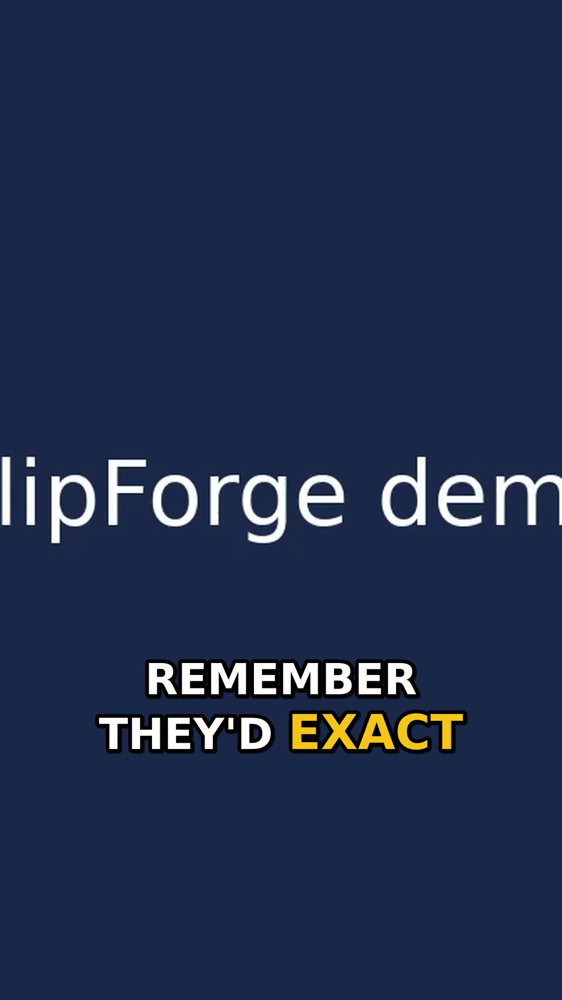

<div align="center">

# ◆ ClipForge

**One long video in. A batch of ranked, vertical, captioned short clips out.**

Drop in a podcast, interview, webinar, or talk → ClipForge finds the best moments,
reframes them to 9:16 with the speaker in frame, burns in animated captions, and
ranks every clip by a transparent virality score.

 &nbsp; 

*Real rendered output (1080×1920): word-by-word karaoke captions, safe-zone placement, speaker-aware crop. English & German.*

</div>

---

## What it does

The whole product is one happy path (PRD §2.1):

```
Upload  →  Transcribe  →  Detect moments  →  Score & rank  →  Reframe 9:16  →  Caption  →  Render  →  Review  →  Export
```

You bring a video; ClipForge returns a grid of publish-ready short clips sorted by
predicted reach. Open any clip in a light editor to nudge the trim, fix a caption,
restyle, or override the crop — edits re-render **only that clip**, never the batch,
and never touch the original.

## The four pillars

Everything is built around the four things the PRD says the product is judged on
(§3). Each lives behind a small provider boundary so a hosted model could replace
the local default without touching the pipeline.

| Pillar | How it works here |
| --- | --- |
| **Moment detection** | Segments the transcript into sentences on punctuation + speech pauses, grows candidates that fit the target length, ranks them by an explainable salience blend, and de-duplicates overlaps (non-max suppression). Snaps to natural speech edges so a clip never cuts a word. |
| **Auto-captions** | Word-timed captions from Whisper, rendered as ASS for **libass**: large, high-contrast, uppercase, positioned in the safe zone, with the spoken word **highlighted + popped** one at a time (TikTok style). Editable, with line-wrapping for phone readability. |
| **Vertical reframing** | Samples frames, tracks the dominant face with OpenCV, and builds a **smoothed, velocity-limited** crop path so the camera glides instead of jittering. Falls back to a steady center crop when there's no face (screen-share, graphics). Manual override in the editor. |
| **Virality scoring** | A 0–100 score that is a **transparent weighted sum** of signal features (hook, emotional payoff, standalone clarity, pace, quotability, length fit, list payoff). Weights are tuned per platform. The top contributing factors are shown verbatim as the "reasons" — never a black box. |

Beyond talking-head content, ClipForge also handles **gameplay**: it auto-detects
talking vs gameplay, and for games finds **audio-energy highlights** (kills,
goals, clutches, jump-scares) tuned by an optional **per-game profile**
(Valorant / CS2 / EA FC / Rocket League / Horror / generic — works for any game).
A streamer **facecam** is found automatically (the one face that never moves —
YuNet when available, Haar fallback); clips then use the TikTok-standard
**stacked layout** (cam strip on top, gameplay below) or a **PiP overlay**, the
cam's **reaction energy** feeds the virality score ("streamer reacts hard"), and
the gameplay crop follows the **motion centroid** instead of blindly centering —
all overridable per clip in the editor.
Outputs in **9:16, 4:5, 1:1, or 16:9** (horizontal for YouTube / NLE editing),
captions optionally burned in, plus **montages** that stitch chosen clips into one
video with its own virality score. All **local, no APIs**.

It also **learns from your feedback, locally**: 👍/👎 (and your trims, downloads)
re-weight the *explainable* scoring features toward the clips you keep, and your
trims teach a damped, clamped **boundary correction** so future clips land on the
moment more precisely. Cold-start safe (learned↔default blended by confidence),
fully transparent (`/api/learning` shows what it learned), and resettable.

## Architecture

```
┌─────────────┐     REST + polling      ┌──────────────────────────────────────┐
│  React SPA  │ ───────────────────────▶│             FastAPI app               │
│ (5 screens) │ ◀─────────────────────── │  routes ─ store(SQLite) ─ /media      │
└─────────────┘    clips, progress, mp4  └───────────────┬──────────────────────┘
                                                          │ enqueue
                                          ┌───────────────▼──────────────────────┐
                                          │  Background worker (job orchestrator) │
                                          │  transcribe→detect→score→reframe→     │
                                          │  caption→render  (render fans out)    │
                                          └───────────────┬──────────────────────┘
              providers (pluggable)  ┌───────────────────┼───────────────────┐
                                     ▼                    ▼                   ▼
                            Whisper / synthetic    OpenCV face track     ffmpeg + libass
```

- **Async & re-entrant** (PRD §5.2): processing is a background job; the UI polls
  honest per-stage progress and you can leave and come back. Clips render in
  parallel and stream into the grid as they finish.
- **Graceful degradation**: every heavy dependency is optional and auto-detected.
  No Whisper → synthetic word-timed transcript. No OpenCV → center crop. No
  ffprobe → ffmpeg-based probe. The core loop always runs; the active path is
  reported at `/api/health` and surfaced in the UI.
- **Persistence**: each project is one JSON document in SQLite (the nested object
  graph from PRD §6 — Project, Transcript, Clip, CaptionSet, Reframe, StyleTemplate).
  Media lives on disk under `backend/data/media/` and is served with HTTP range
  support so clips scrub in the browser.

## Tech stack

- **Backend** — Python 3.11, FastAPI, SQLite (stdlib), a static **ffmpeg/ffprobe**
  (bundled via `static-ffmpeg`, no system install needed).
- **AI/media** — `faster-whisper` (word-timed transcription), OpenCV (face
  tracking), ffmpeg + **libass** (crop/scale/caption burn-in/H.264 encode).
- **Frontend** — React 18 + TypeScript + Vite.

## Quickstart

**Prerequisites (install once):** [Python **3.12**](https://www.python.org/downloads/release/python-3120/)
(tick *Add to PATH*; the AI libraries don't support 3.13/3.14 yet) and
[Node.js LTS](https://nodejs.org). On Windows also install the
[VC++ Redistributable](https://aka.ms/vs/17/release/vc_redist.x64.exe) (Whisper needs it).

### Easiest — Windows (double-click)
1. **Double-click `setup.bat`** — creates an isolated Python 3.12 env, installs
   everything, builds the UI. (Run once.)
2. **Double-click `run.bat`** — starts the server and opens
   **http://localhost:8000**. That's it — one window, one URL.

### macOS / Linux (or Git Bash)
```bash
./setup.sh      # one-time
./run.sh        # starts http://localhost:8000
```

### Manual / dev mode (hot reload)
```bash
cd backend && pip install -r requirements.txt && uvicorn app.main:app --reload --port 8000
cd frontend && npm install && npm run dev      # http://localhost:5173
```

The scripts build the frontend and let the backend serve it, so the whole product
runs from a **single process on http://localhost:8000** — no second terminal.

### Configuration (env vars)

| Variable | Default | Purpose |
| --- | --- | --- |
| `CLIPFORGE_WHISPER_MODEL` | *auto* | **Auto-selected for your hardware** (GPU→`large-v3`, strong CPU→`small`, weak→`tiny`). Set to override. |
| `CLIPFORGE_TRANSCRIBER` | `auto` | `auto` (whisperX if installed, else faster-whisper), or force `whisperx`/`faster`/`synthetic`. |
| `CLIPFORGE_DEVICE` | *auto* | `cuda` when a usable GPU is detected, else `cpu`. Set to force. |
| `HF_TOKEN` | – | Hugging Face token; enables whisperX **speaker diarization** (gated pyannote model). |
| `CLIPFORGE_OLLAMA_URL` | `http://localhost:11434` | Local LLM (Ollama) for AI titles/hooks; used only if reachable. |
| `CLIPFORGE_LLM_MODEL` | `llama3.2` | Ollama model for titles. |
| `CLIPFORGE_RENDER_WORKERS` | *auto* | Parallel clip renders (scaled to CPU cores). |
| `CLIPFORGE_DATA_DIR` | `backend/data` | Where the DB + media live. |
| `CLIPFORGE_MAX_UPLOAD_MB` | `2048` | Upload / URL-import size cap. |
| `FFMPEG_BIN` / `FFPROBE_BIN` | auto | Override binary resolution. |

Default spoken language is **German** (English/auto selectable per project).
Game events can be pinpointed by matching reference **audio cues** — see
[docs/GAME_CUES.md](docs/GAME_CUES.md). Optional **AI titles** use a local
[Ollama](https://ollama.com) model when running (otherwise heuristic titles).

**Transcription engines (auto-selected, with fallback):** whisperX → faster-whisper
→ synthetic. Install the optional, higher-quality engine with `pip install whisperx`
(adds forced word-level alignment + speaker diarization; PyTorch-heavy, GPU
recommended). When absent, faster-whisper is used; the active engine shows in the nav bar.

## Language support

Transcription auto-detects the spoken language. Moment detection and scoring are
**language-aware**: the signal lexicons (hooks, emotion, payoff, weak openers,
enumerations) exist for **English and German**, and the active set is chosen from
the transcript's detected language — so a German talk gets German-tuned moment
picks and scores. Pick *Auto-detect / English / German* at import, or set the
default with the per-project language hint. Unknown languages fall back to English
lexicons (transcription still works for any Whisper-supported language).

## API overview

| Method | Path | Purpose |
| --- | --- | --- |
| `GET` | `/api/health` | Version + detected capabilities |
| `POST` | `/api/projects` | Import (multipart file **or** `url`) + settings; enqueues processing |
| `GET` | `/api/projects` | Recent projects (summaries) |
| `GET` | `/api/projects/{id}` | Full project (clips, factors, transcript) |
| `GET` | `/api/projects/{id}/status` | Lightweight polling: status + per-stage progress + clip cards |
| `PATCH` | `/api/projects/{id}/clips/{cid}` | Edit (trim / title / style / caption text / crop) → re-renders that clip |
| `GET` | `/api/projects/{id}/clips/{cid}/download` | Download one clip |
| `POST` | `/api/projects/{id}/reprocess` | Re-run on the stored source (applies ratings/cues/overrides) |
| `GET` | `/api/projects/{id}/clips/{cid}/captions.srt` | Caption sidecar for NLE editing |
| `POST` | `/api/projects/{id}/montage` | Stitch chosen clips into one scored montage |
| `GET` | `/api/projects/{id}/montages/{mid}/download` | Download a montage |
| `POST` | `/api/projects/{id}/clips/{cid}/feedback` | 👍/👎 a clip — teaches the local scorer |
| `GET` | `/api/learning` | What the local learner has picked up (transparency) |
| `POST` | `/api/learning/reset` | Forget learned preferences |
| `GET` | `/api/projects/{id}/export` | Zip of all rendered clips |
| `GET` | `/api/styles` | Caption style templates |
| `DELETE` | `/api/projects/{id}` | Delete project + media |

## Project structure

```
backend/
  app/
    main.py              FastAPI app, /media, SPA serving, health
    config.py            settings + capability detection
    models.py            domain objects (PRD §6)
    store.py             SQLite document store
    styles.py            caption style templates
    media/ffmpeg.py      ffmpeg/ffprobe wrappers (probe, audio, thumbs)
    providers/           pluggable "AI" stages
      transcribe.py        Whisper + synthetic fallback (en/de)
      signals.py           language-aware, explainable signal features
      detect.py            moment detection
      score.py             virality scoring (per-platform weights)
    pipeline/
      orchestrator.py      job queue + stage sequencing + progress
      ingest.py            upload / URL import + probe
      captionize.py        transcript → clip caption set
      captions.py          caption set → ASS (libass)
      reframe.py           face tracking → smoothed 9:16 crop path
      render.py            ffmpeg cut + crop + caption burn + encode
  tests/                 unit + end-to-end smoke tests
frontend/
  src/screens/           Upload, ProjectView (Processing/Grid), ClipEditor
  src/components/         ClipCard, ScoreBadge, ProcessingView, ClipGridView
  src/lib/               api client, types, formatting
```

## Testing

```bash
cd backend
python -m tests.test_units        # fast pure-logic units (no ffmpeg/Whisper)
python -m tests.smoke_pipeline    # end-to-end on a generated video
python -m tests.real_pipeline     # end-to-end with real TTS speech + Whisper (needs piper voice)
```

## How this maps to the PRD

**Built (Must-have, PRD §4 — "prove the loop"):** one-video import (file + URL),
moment detection, 9:16 reframe with speaker tracking, burned-in word-timed
captions, virality score with reasons, sortable/filterable clip grid, lightweight
editor (trim, caption text, style, crop override), MP4 export + batch zip.
**Should-have also in:** caption style templates, platform-specific scoring,
project library/history, reframe override.

**Deferred (PRD §4 "Could/Won't have v1"):** split-screen layouts, branding/intros,
auto hashtags, direct posting/scheduling, team workspaces, full timeline editing.
Speaker **diarization** is stubbed (single speaker); reframe uses face tracking,
not audio-visual active-speaker detection.

**On the PRD's open questions (§9):** scoring is explainable and platform-tunable
without historical data (transparent weighted signals); language is multi
(English + German) with auto-detection rather than single-language.

---

*v0.1 — exploration build. The goal, per the PRD: drop in a long video, get back a
set of genuinely good short clips you'd actually post.*
